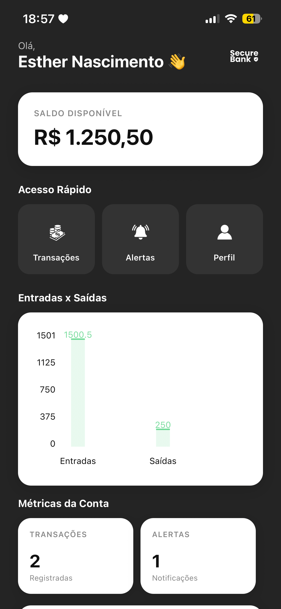
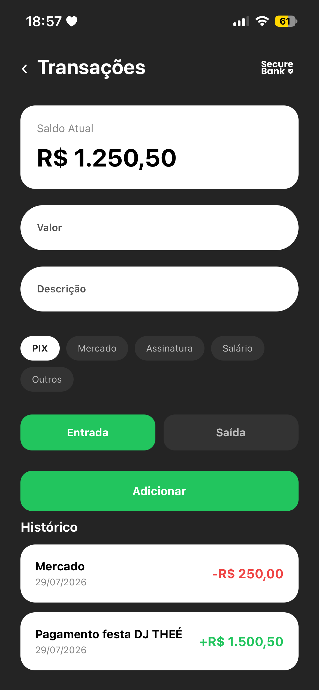
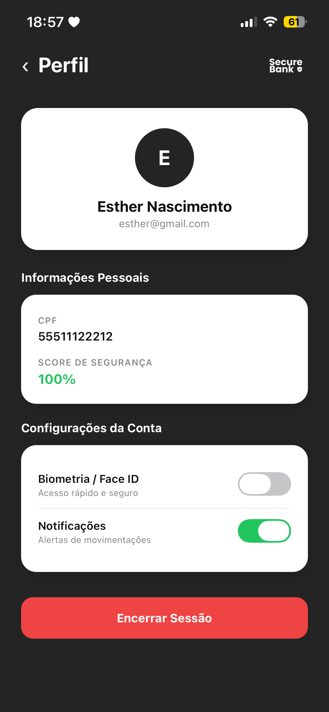
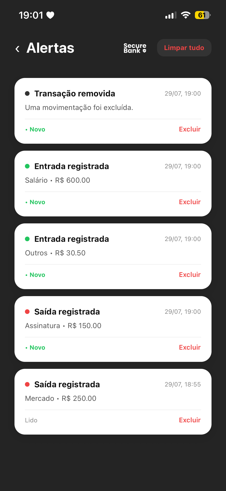

  

<h1 align="center">💳 SecureBank</h1>

Aplicativo mobile fullstack que simula um banco digital, desenvolvido com **React Native**. O projeto cobre todo o fluxo de um app financeiro real: cadastro, login, dashboard com métricas e gráficos, gestão de transações, alertas e perfil do usuário — com persistência local via `AsyncStorage`.

## 📱 Sobre o Projeto

O SecureBank foi criado para simular a experiência de um aplicativo bancário completo, com foco em:

- Fluxo de autenticação (Cadastro → Login)
- Dashboard com visão geral da conta, métricas e gráficos
- Registro e histórico de transações (entradas e saídas)
- Central de alertas e notificações
- Perfil do usuário com configurações de segurança (biometria, notificações)
- Persistência de dados 100% local, sem backend ou dados mockados

## ✨ Funcionalidades

- ✅ Cadastro e login de usuário
- ✅ Dashboard com saldo, métricas da conta e gráfico de Entradas x Saídas
- ✅ Adição de transações com categoria (PIX, Mercado, Assinatura, Salário, Outros)
- ✅ Edição e exclusão de transações, com ajuste automático de saldo
- ✅ Histórico de transações com detalhamento completo
- ✅ Central de alertas (marcar como lido, excluir, limpar tudo)
- ✅ Perfil com dados do titular, score de segurança e configurações (biometria/notificações)
- ✅ Logout com confirmação

## 🛠️ Tecnologias

- [React Native](https://reactnative.dev/)
- [React Navigation](https://reactnavigation.org/)
- [AsyncStorage](https://github.com/react-native-async-storage/async-storage)
- [react-native-chart-kit](https://github.com/indiespirit/react-native-chart-kit)
- [react-native-svg](https://github.com/software-mansion/react-native-svg)

## 📂 Estrutura do Projeto

    src/
    ├── components/       # Componentes reutilizáveis (Logo, Input, PrimaryButton, Modal, TransactionCard, AlertCard)
    ├── context/          # Contextos globais da aplicação
    ├── data/             # Dados e configurações auxiliares
    ├── navigation/        # Configuração de rotas e navegação
    ├── pages/             # Telas do app
    │   ├── Cadastro/
    │   ├── Login/
    │   ├── Splash/
    │   ├── Dashboard/
    │   ├── Transactions/
    │   ├── TransactionDetails/
    │   ├── Alerts/
    │   └── Profile/
    └── services/          # Funções de acesso ao AsyncStorage (storage.js)

Cada tela segue o padrão `index.js` (lógica) + `style.js` (estilos), mantendo a separação entre lógica e apresentação.

## 🚀 Como Executar

### Pré-requisitos

- [Node.js](https://nodejs.org/)
- [Expo CLI](https://docs.expo.dev/get-started/installation/) ou ambiente configurado para React Native
- Um emulador Android/iOS ou o app **Expo Go** no celular

### Passos

Clone o repositório:

    git clone https://github.com/seu-usuario/securebank.git

Acesse a pasta do projeto:

    cd securebank

Instale as dependências:

    npm install

Inicie o projeto:

    npx expo start

Depois disso, escaneie o QR Code com o app Expo Go ou rode em um emulador.

## 🗺️ Fluxo do App

    Splash → Cadastro / Login → Dashboard
                                    ├── Transações → Detalhes da Transação
                                    ├── Alertas
                                    └── Perfil

## 📸 Screenshots

| Dashboard | Transações | Perfil | Alertas |
|-----------|------------|--------|---------|
|  |  |  |  |

## 📄 Licença

Este projeto está sob a licença [MIT](LICENSE).
Foi desenvolvido com o intuito de aprender.

---

Desenvolvido com 💚 por [Esther Nascimento](https://github.com/esthernascimento)
